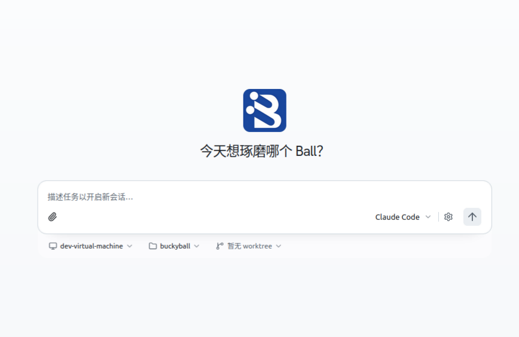

# buckyball.ai

> 今天想琢磨哪个 Ball？ — _"Which Ball do you want to tinker with today?"_



[🇨🇳 Chinese version](./README.zh.md)

## What is this?

**buckyball.ai** (short: **bb.ai**) is an **external AI meta-harness for the [Buckyball](https://github.com/DangoSys/buckyball) project**.

Buckyball is an open-source framework for building **Domain-Specific Architectures (DSAs)**. It ships the **bebop** agile simulator, the **bbdev** compile / verify toolchain, an MLIR-based compiler, multiple simulation backends (Verilator, BEMU, P2E, FireSim) and a full set of workflows (compiler, workload, kernel, yosys, firesim, …). bb.ai does **not** re-implement any of that — it sits one layer above and does exactly four things:

- **Discover** any Buckyball project root on the local machine (any directory that contains both `.claude/skills/` and `.mcp.json`).
- **Load** every `SKILL.md` it finds (e.g. `/ball`, `/bbdev`, `/verify`, `/waveform`) as Agent-callable skills.
- **Mount** the MCP servers declared in that project's `.mcp.json` (by default: 33 `bbdev_*` tools + `waveform-mcp`).
- **Expose** this "Buckyball-aware" Agent through a web UI so a user can drive the entire DSA flow — write a Ball, compile MLIR, run synthesis, dump waveforms, deploy to FPGA — using natural language.

In one line:

> **Buckyball = toolchain + simulator + compiler**
> **bb.ai    = the layer that teaches an AI Agent to talk to the toolchain**

bb.ai is built on top of the [Omnigent](https://github.com/databricks/omnigent) Agent runtime. The core registration logic lives in [`omnigent/skills/buckyball/`](omnigent/skills/buckyball/), which turns buckyball's filesystem markers (`.claude/skills/` + `.mcp.json`) into `SkillSpec` and `MCPServerConfig` objects on an `AgentSpec`.

[🇨🇳 中文版文档](./README.zh.md)

---

## Repository layout

```
buckyball.ai/
├── omnigent/                    # Agent runtime (forked from omnigent)
│   ├── skills/
│   │   └── buckyball/           # ★ the heart of bb.ai
│   │       ├── discovery.py     #   scan .claude/skills/ + .mcp.json
│   │       ├── loader.py        #   SKILL.md → SkillSpec
│   │       │                    #   .mcp.json  → MCPServerConfig
│   │       └── tests/           #   UTF-8-safe parsing + env-var expansion
│   ├── server/                  # FastAPI: /v1/agents, /v1/sessions
│   ├── runtime/                 # reasoning loop + tool dispatch
│   ├── repl/                    # terminal REPL
│   └── tools/                   # local / MCP tools
├── web/                         # React + Vite + Tailwind v4 + shadcn/ui
│                               # (the screenshot above is this UI)
├── deploy/                      # deployment targets
│                               # (Docker / Fly / K8s / Cloudflare / Databricks / …)
├── docs/
│   └── images/bb-ai.png         # README hero image
├── examples/                    # pre-baked Agent examples
└── sdks/                        # Python Client + UI SDK
```

The thing bb.ai *consumes* lives in a separate repository: [DangoSys/buckyball](https://github.com/DangoSys/buckyball). A valid buckyball project must contain at least these two marker files:

```
<your-buckyball-project>/
├── .mcp.json                    # declares MCP servers (e.g. buckyball-dev)
└── .claude/
    └── skills/<name>/SKILL.md   # one or more Agent-callable skills
```

When bb.ai starts, it walks **up to 8 levels** from the Agent's cwd to find such a root.

---

## Quick deploy & usage

Below are the two most common ways to run bb.ai: a local dev setup (recommended to start) and a multi-user remote deployment.

### 0. Prerequisites

- Python ≥ 3.12
- Node.js ≥ 20 and `pnpm`
- A **buckyball project root** (with `.mcp.json` and `.claude/skills/`), or a fresh clone of [DangoSys/buckyball](https://github.com/DangoSys/buckyball) brought up with `nix develop`
- Optional: `uv`, `just`, `pre-commit`

### 1. Local dev (recommended)

```bash
# 1. Clone bb.ai
git clone https://github.com/your-org/buckyball.ai.git
cd buckyball.ai

# 2. Install Python dependencies
uv sync --extra all --extra dev

# 3. Install the web dependencies
cd web && pnpm install && cd ..

# 4. Prepare a buckyball project (if you don't already have one)
#    bb.ai will search up to 8 levels above the Agent's cwd for
#    .claude/skills/ + .mcp.json
git clone https://github.com/DangoSys/buckyball.git ~/bb-work/buckyball
cd ~/bb-work/buckyball
nix develop            # brings the buckyball-dev MCP server (stdio) online
```

Now start the backend and the web UI in two terminals:

```bash
# Terminal A: omnigent server (default port 6767)
.venv/bin/omnigent server

# Terminal B: Vite dev server (default port 5173)
cd buckyball.ai/web
pnpm run dev
```

Open <http://localhost:5173> — you should see the screenshot above.

**Try this prompt:** _"Run a vecunit matmul simulation on the toy chip."_ The Agent will call `bbdev_bebop_verilator_run` (and friends) under the hood, drive the full `build → sim` flow, and reply with the results.

### 2. Remote / multi-user deployment

`bb.ai` ships with pre-baked configs for several platforms under `deploy/`. Docker is the recommended production path:

```bash
cd deploy/docker
cp .env.example .env
# Edit .env — point BUCKYBALL_ROOT at your real buckyball project root

# Start the stack (omnigent server + reverse proxy + health checks)
docker compose up -d
```

Other ready-to-go targets:

| Platform    | Path                    |
|-------------|-------------------------|
| Docker      | `deploy/docker/`        |
| Kubernetes  | `deploy/kubernetes/`    |
| Fly.io      | `deploy/fly/`           |
| Railway     | `deploy/railway/`       |
| Render      | `deploy/render/`        |
| Cloudflare  | `deploy/cloudflare/`    |
| HF Spaces   | `deploy/hf-spaces/`     |
| Databricks  | `deploy/databricks/`    |

Each subdirectory has its own `README.md` and platform manifest, all sharing a single contract:

> **Set the env var `BUCKYBALL_ROOT` to one or more ready-to-use buckyball project roots. bb.ai will load them on startup.**

### 3. Wire bb.ai into your own buckyball project

Just two files:

1. Drop a `.mcp.json` at the project root (template mirrored from the buckyball reference project):

   ```json
   {
     "mcpServers": {
       "buckyball-dev": {
         "command": "bash",
         "args": ["${BUCKYBALL_ROOT}/scripts/claude/run_mcp_server.sh"],
         "env": { "NIX_QUIET": "1" },
         "description": "Buckyball compile/verify toolchain (33 bbdev_* MCP tools)",
         "cwd": "${BUCKYBALL_ROOT}"
       }
     }
   }
   ```

2. Add skills under `.claude/skills/<name>/SKILL.md`. Frontmatter looks like:

   ```yaml
   ---
   name: my-skill
   description: short description — the Agent uses this to decide when to invoke
   user-invocable: true
   ---

   # Markdown body
   ```

On startup, bb.ai walks up from the cwd to find your project root, then:
- appends every parsed `SkillSpec` to `AgentSpec.skills`
- appends every parsed `MCPServerConfig` to `AgentSpec.mcp_servers`
- dedupes by name, with bb.ai's bundled skills winning ties

No restart needed — `find_buckyball_roots` runs every time an `AgentSpec` is built.

### 4. Programmatic access

bb.ai also ships Python and UI SDKs:

```bash
pip install omnigent-client==0.9.0.dev0
```

```python
from omnigent_client import Omnigent

client = Omnigent(server_url="http://localhost:6767")

# List registered agents
agents = client.agents.list()

# Open a session — the Agent will automatically pick up the skills
# and MCP servers from the nearest buckyball project root above cwd
session = client.sessions.create(agent=agents[0].name)
session.send("Run a matmul sim on toy and dump the waveform")
for chunk in session.stream():
    print(chunk.text, end="")
```

---

## How it works (one-paragraph version)

[`omnigent/skills/buckyball/discovery.py`](omnigent/skills/buckyball/discovery.py) walks up to 8 directory levels from the Agent's cwd, looking for any directory that contains both `.claude/skills/<x>/SKILL.md` and `.mcp.json`. [`omnigent/skills/buckyball/loader.py`](omnigent/skills/buckyball/loader.py) then parses those files into `SkillSpec` and `MCPServerConfig` objects, expanding `${VAR}` references inside `.mcp.json` (auto-injecting `BUCKYBALL_ROOT`). Finally, [`attach_buckyball_to_spec`](omnigent/skills/buckyball/loader.py) merges the results into an `AgentSpec`. When the Omnigent runtime starts, it spawns the declared MCP servers as stdio subprocesses — and the web UI gets a Buckyball-aware Agent to talk to.

Dive deeper:

- [`omnigent/skills/buckyball/__init__.py`](omnigent/skills/buckyball/__init__.py) — module exports
- [`omnigent/skills/buckyball/discovery.py`](omnigent/skills/buckyball/discovery.py) — root-detection rules
- [`omnigent/skills/buckyball/loader.py`](omnigent/skills/buckyball/loader.py) — SKILL.md / .mcp.json parsing

---

## Documentation

- Runtime: [omnigent/runtime/README.md](omnigent/runtime/README.md)
- Server API: [omnigent/server/API.md](omnigent/server/API.md)
- Database schema: [omnigent/server/DBSPEC.md](omnigent/server/DBSPEC.md)
- Agent spec: [omnigent/spec/AGENTSPEC.md](omnigent/spec/AGENTSPEC.md)
- Policy layer: [docs/POLICIES.md](docs/POLICIES.md)

## Contributing

See [CONTRIBUTING.md](./CONTRIBUTING.md) and [AGENTS.md](./AGENTS.md). Before committing, run `pre-commit run --all-files`.

## Security

See [SECURITY.md](./SECURITY.md).

## License

[Apache License 2.0](./LICENSE)
